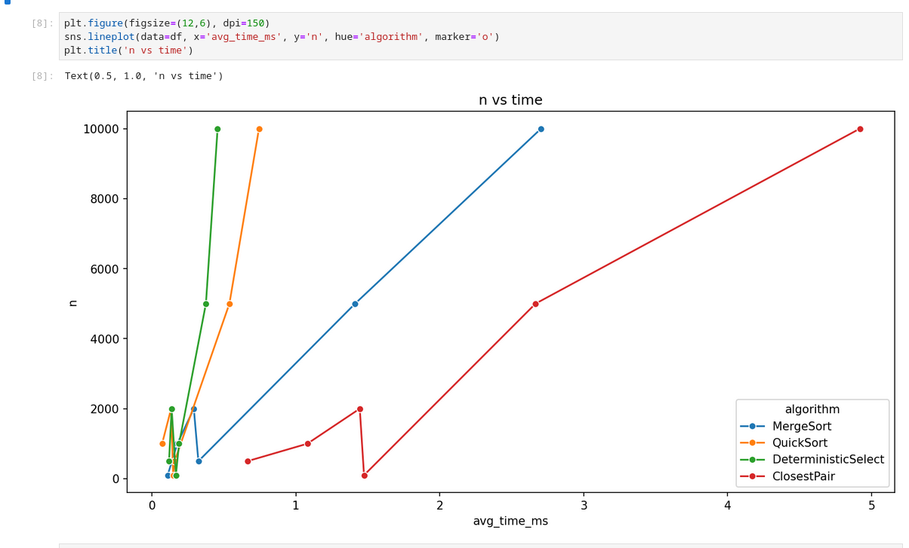
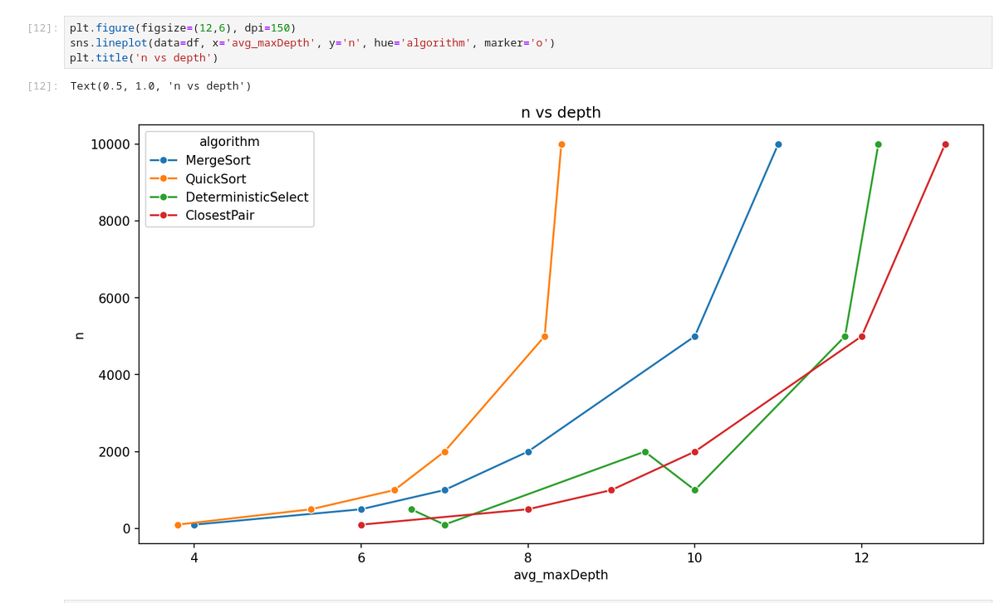
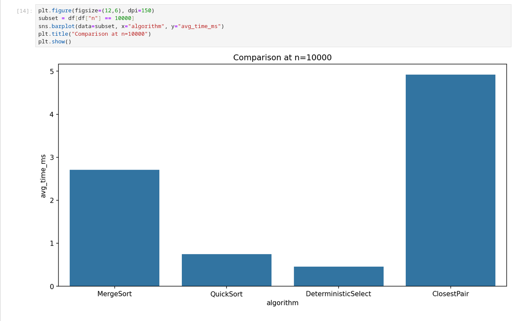

## Recurrence Analysis

### MergeSort
T(n) = 2T(n/2) + Θ(n)  
Master theorem case 2 → T(n) = Θ(n log n)

### QuickSort
Average: T(n) = T(k) + T(n-k-1) + Θ(n), E[k] ≈ n/2  
Θ(n log n) expected, Θ(n²) worst-case (rare with random pivot).

### Deterministic Select (Median of Medians)
T(n) = T(n/5) + T(7n/10) + Θ(n)  
By Akra–Bazzi intuition → Θ(n)

### Closest Pair of Points
T(n) = 2T(n/2) + Θ(n)  
Master theorem case 2 → Θ(n log n)

# Assignment 1 Report

## Introduction

The goal of this assignment was to implement classic divide and conquer algorithms, analyze their running time using Master Theorem and Akra–Bazzi intuition, and validate the theory with experiments. I also collected metrics such as time, recursion depth, comparisons, and allocations. The algorithms implemented were MergeSort, QuickSort, Deterministic Select, and Closest Pair of Points.

## Implementations

MergeSort: The algorithm uses a linear merge procedure. I added a reusable buffer to avoid too many new allocations. For small arrays there is a cutoff where insertion sort is used instead.

QuickSort: The pivot is randomized. The recursion is always done on the smaller partition and the larger one is processed iteratively. This keeps the recursion depth bounded to about O(log n).

Deterministic Select: Implemented with the median-of-medians method. Elements are grouped by 5, then the median of medians is chosen as the pivot. Partition is done in-place and recursion only happens on the side that contains the k-th element.

Closest Pair of Points: The points are first sorted by x coordinate. Then I split the set into two halves and solve recursively. In the strip step I check points sorted by y, and only up to 7 neighbors are compared, which makes the algorithm efficient.

## Recurrence Analysis

* MergeSort: T(n) = 2T(n/2) + O(n). By Master Theorem case 2 this is Θ(n log n).
* QuickSort: On average T(n) = Θ(n log n). Worst case is Θ(n^2), but the randomized pivot makes this unlikely.
* Deterministic Select: T(n) = T(n/5) + T(7n/10) + O(n). By Akra–Bazzi this is Θ(n).
* Closest Pair: T(n) = 2T(n/2) + O(n). Again by Master Theorem case 2 this is Θ(n log n).

## Experimental Results

Time vs n

Graphs of running time show that MergeSort and QuickSort both grow like n log n. QuickSort is usually faster in practice because of better cache usage. Deterministic Select is linear but has a larger constant factor so it is slower on small arrays. Closest Pair matches the expected n log n growth.

Recursion depth vs n

Recursion depth graphs show that MergeSort has depth about log n. QuickSort stays within O(log n) as expected because of the smaller-side recursion trick. Select has very low recursion depth because it only recurses into one part.

Comparisons and allocations

MergeSort without buffer does many allocations. With reusable buffer, the number goes down a lot. QuickSort does fewer allocations but usually more comparisons.

## Conclusion

The experiments match the theoretical analysis. QuickSort and MergeSort both perform in Θ(n log n), but QuickSort tends to be faster in practice. Deterministic Select confirms linear complexity, although it is slower for small inputs because of the constant factor. Closest Pair also works as expected with Θ(n log n). Overall, the implementation results align well with theory, and the metrics show how recursion control and memory usage affect performance.

